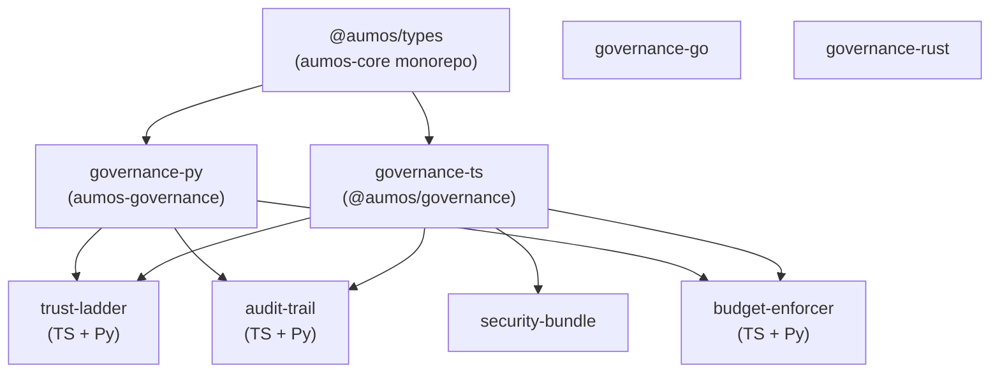

<!-- SPDX-License-Identifier: CC-BY-SA-4.0 -->
<!-- Copyright (c) 2026 MuVeraAI Corporation -->

# aumos-sdks — Package Guide

`aumos-sdks` is the SDK and library monorepo for AumOS governance tooling.
It provides the runtime governance engine in four languages and three utility
libraries that integrate directly with the engine.

---

## What Is in This Monorepo

| Sub-package | Path | Language | Published as | License |
|---|---|---|---|---|
| **governance-ts** | `packages/governance-ts/` | TypeScript | `@aumos/governance` | BSL-1.1 |
| **governance-py** | `packages/governance-py/` | Python | `aumos-governance` | BSL-1.1 |
| **governance-go** | `packages/governance-go/` | Go | `github.com/aumos-ai/aumos-sdks/go/governance` | BSL-1.1 |
| **governance-rust** | `packages/governance-rust/` | Rust (workspace) | `aumos-governance-core` (crates.io) | BSL-1.1 |
| **trust-ladder** | `packages/trust-ladder/` | TypeScript + Python | `@aumos/trust-ladder` / `trust-ladder` | BSL-1.1 |
| **audit-trail** | `packages/audit-trail/` | TypeScript + Python | `@aumos/audit-trail` / `agent-audit-trail` | Apache 2.0 |
| **budget-enforcer** | `packages/budget-enforcer/` | TypeScript + Python | `@aumos/budget-enforcer` / `budget-enforcer` | BSL-1.1 |
| **security-bundle** | `packages/security-bundle/` | TypeScript | `@aumos/security-bundle` | BSL-1.1 |

---

## Where to Start

Choose your language SDK first:

| Use case | Start here |
|---|---|
| TypeScript / Node.js | `packages/governance-ts/` (`@aumos/governance`) |
| Python | `packages/governance-py/` (`aumos-governance`) |
| Go microservices | `packages/governance-go/` |
| Rust / WASM / edge | `packages/governance-rust/crates/aumos-governance-core` |

Each SDK exposes the same conceptual API: `GovernanceEngine`, `TrustManager`,
`BudgetManager`, `ConsentManager`, and `AuditLogger`. The utility libraries
(`trust-ladder`, `audit-trail`, `budget-enforcer`) provide standalone implementations
of those sub-systems that can be used with or without the full engine.

---

## Cross-Package Dependencies



The Go and Rust SDKs depend only on the Go and Rust standard libraries respectively.
They do not share a dependency on `@aumos/types`.

---

## Build and Test Commands

### TypeScript (workspace root)

```bash
npm install
npm run build
npm run typecheck
npm run lint
npm run test
npm run fire-line-audit
```

### Python packages (per package)

```bash
pip install -e ".[dev]"
ruff check src/
mypy src/
pytest
```

### Go (`packages/governance-go/`)

```bash
go build ./...
go test -race ./...
golangci-lint run
```

### Rust (`packages/governance-rust/`)

```bash
cargo build
cargo test
cargo clippy -- -D warnings
cargo fmt --check
```

---

## Allowed Operations Per Manager

The fire line constrains which operations each manager may implement:

| Manager | Permitted methods |
|---|---|
| `TrustManager` | `setLevel()`, `getLevel()`, `checkLevel()` |
| `BudgetManager` | `createBudget()`, `recordSpending()`, `checkBudget()` |
| `ConsentManager` | `recordConsent()`, `checkConsent()`, `revokeConsent()` |
| `AuditLogger` | `log()`, `query()` |

No adaptive, ML-based, or automatic trust progression is permitted.
All trust changes are manual. All budget allocations are static.

---

## Contributing

See [CONTRIBUTING.md](../CONTRIBUTING.md) and [FIRE_LINE.md](../FIRE_LINE.md).

---

Copyright (c) 2026 MuVeraAI Corporation. BSL-1.1 / Apache 2.0.
